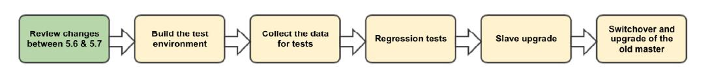

# MySQL5.7小版本升级实践 
本次分享从MySQL5.7.18升级到MySQL5.7.30的实践，MySQL完整的升级流程如下：


## 1、主要变更Review
在开始升级MySQL之前，需要先查看[官方手册](https://dev.mysql.com/doc/refman/5.7/en/mysql-nutshell.html)
，确定好目标版本与现在使用版本之间的重大变更，如果两个版本之间存在不兼容，需要与开发人员协
商解决方案。主要关注点包括Schema变更，新增系统变量、状态变量，SQL模式等.
 
## 2、规划完整的升级过程
在完成步骤1以后，需要根据当前数据量来确认升级方式. MySQL常见的升级方式包含以下两种：

-  [逻辑升级](https://dev.mysql.com/doc/refman/5.7/en/upgrade-binary-package.html#upgrade-procedure-logical):
适用于

- [原地升级](https://dev.mysql.com/doc/refman/5.7/en/upgrade-binary-package.html#upgrade-procedure-inplace):
适用于
  

## 3、升级从库
在确认完上一步之后，我们就可以开始升级生产环境的数据库了，在一套主从环境中，先升级完从库，最后升级主库。
升级从库的流程如下:

- 1、运行下列命令，关闭MySQL数据库之前，先将驻留在内存里面的数据刷新到数据文件
  ```bash
  1 mysql> set global innodb_fast_shutdown=0;
  2 Query OK, 0 rows affected (0.00 sec)
  ```

- 2、运行下面的命令，停止MySQL服务
  ```bash
  shell> service mysqld stop
  ```
  
- 运行下列命令，将旧版MySQL二进制文件移除
  ```bash
  shell> rpm -e mysql-community-{server,client,common,libs,libs-compat}-5.7.18-1.el7.x86_64  --nodeps
  ```

- 运行下列命令，安装新版MySQL二进制文件
  ```bash
  shell> rpm -ivh mysql-community-{server,devel,client,common,libs,libs-compat}-5.7.30-1.el7.x86_64.rpm
  ```

- 运行下列命令，使用原来的配置文件，将MySQL实例启动
  ```bash
  shell> systemctl start mysqld
  ```

- 运行下列命令，修复新旧版本不兼容的地方
  ```bash
  shell> mysql_upgrade -u root -ppasswd
  ```

- 运行下列命令，重启MySQL实例
  ```bash
  shell> systemctl restart mysqld
  ```

## 3、Switchover之后，升级主库